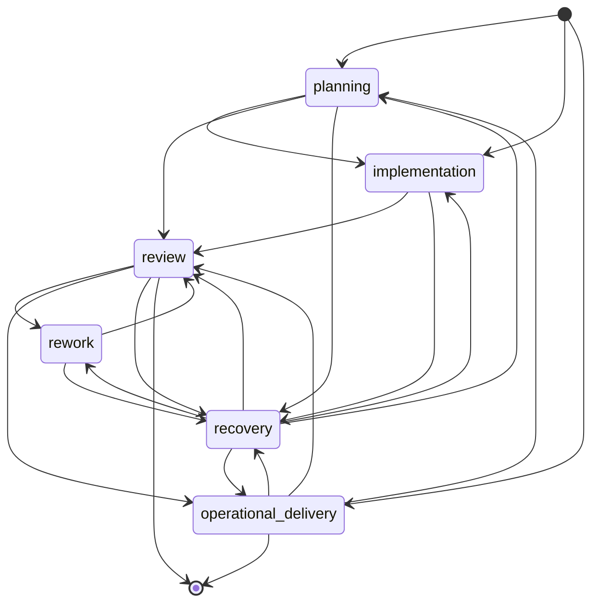

# Context Atlas Mode Transition Graph

## Purpose

Define the allowed mode-transition graph for Context Atlas and make it
explicit how protocol execution relates to mode changes without collapsing the
two concepts together.

## Scope

This document governs the mode-transition graph only.

It does not define protocol step sequences, runtime triggers, or the detailed
shape of handoff contracts.

## Allowed Transition Graph

## Binding Decisions

### 1. Not Every Protocol Step Implies A Mode Change

Context Atlas should treat protocol steps and mode transitions as related but
not one-to-one.

A protocol may:

- spend several steps inside one mode
- revisit a mode more than once
- require a structured contract without requiring a fresh mode shift

### 2. Planning May Route Directly Into Implementation

Context Atlas should allow `planning` to route directly into `implementation`
when decomposition or sequencing work has produced a valid downstream handoff
for deliverable creation.

That direct transition is part of the normal workflow shape, not an exception
that requires recovery or a fresh protocol start.

### 3. Review Is A Convergence State For Submitted Work

`review` is the primary convergence point for work that has been submitted for
governed assessment.

That means several productive modes may hand off into review, but review
itself does not replace those productive modes.

### 4. Rework Loops Through Review

Context Atlas should treat `rework` as returned work that normally flows back
into `review` when complete.

That keeps rework accountable to the same governed assessment surface instead
of becoming an untracked parallel implementation stream.

### 5. Recovery Routes Back Into Stable Modes

`recovery` exists to restore a safe path, so its main transition job is to
route work back into a stable next mode once the blocked or ambiguous state is
resolved.

### 6. Protocol Exit Is Not A Mode

The terminal state shown in the graph is a protocol exit, not a seventh mode.

That distinction matters because accepted completion or delivery may end a
workstream without implying that a new execution mode has been entered.

## Constraints

- The graph should stay explicit enough that later runtime materialization does
  not invent hidden mode jumps.
- New transitions should be justified by protocol reality rather than local
  workflow preference.
- The graph should not be mistaken for a full protocol catalog.

## Non-Goals

- Define protocol-by-protocol step diagrams.
- Define runtime-specific event triggers.
- Define the detailed payload for every transition.

## Related Artifacts

- [Context Atlas Mode Model](./Mode-Model.md)
- [Mode Transition Rules](./Mode-Transition-Rules.md)
- [Context Atlas Role-Mode Matrix](./Role-Mode-Matrix.md)
- [Portable Mode Model](../../AgenticDevelopment/Mode-Model.md)
